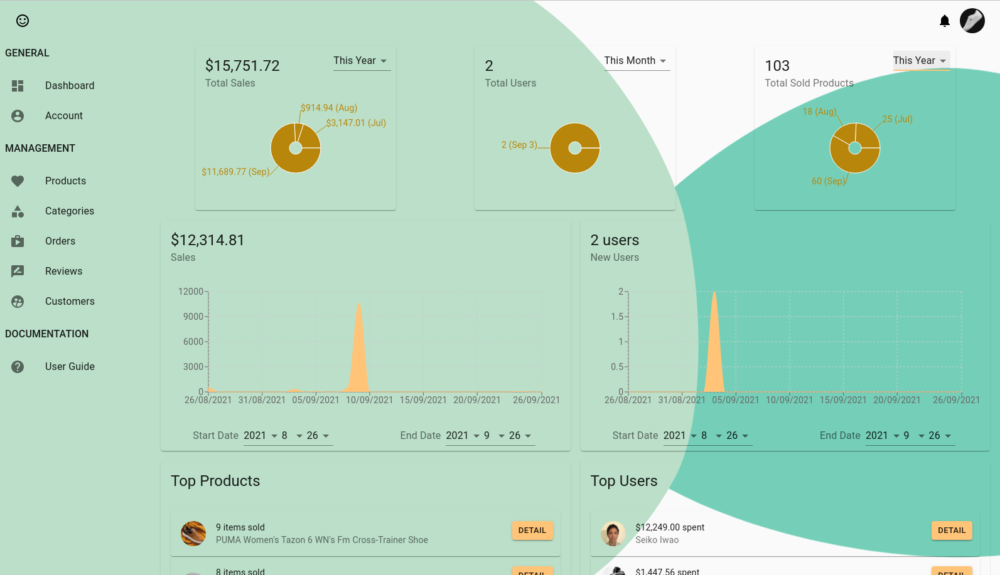
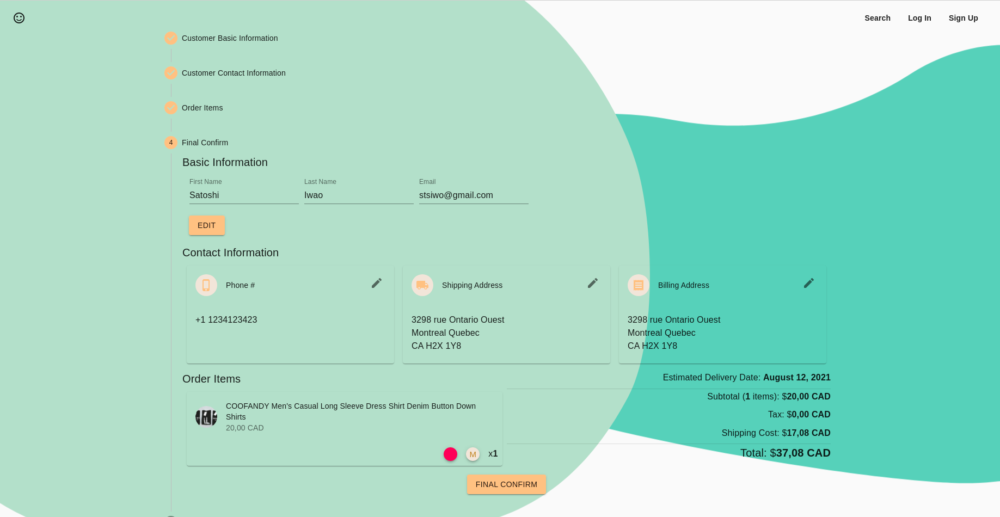
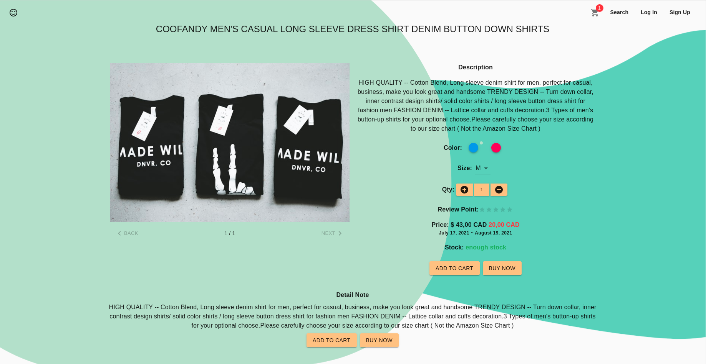
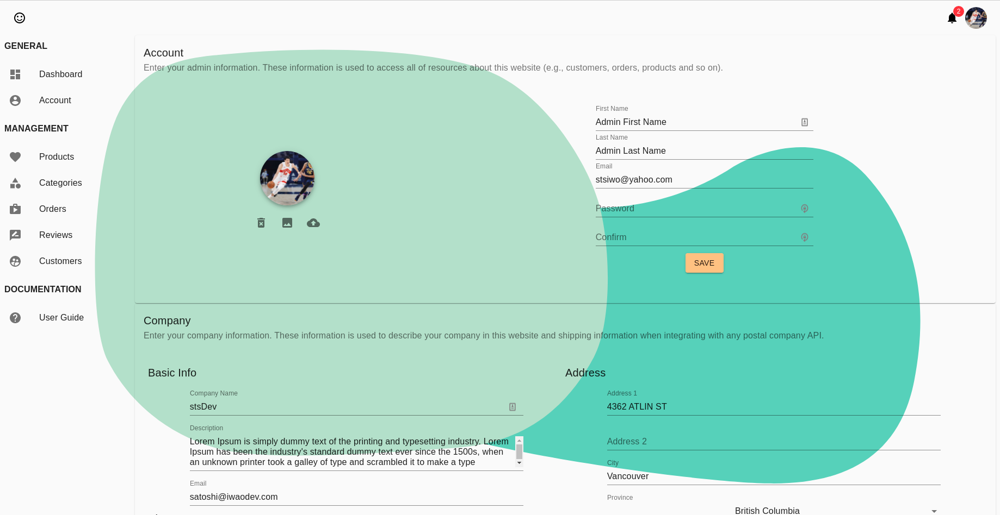
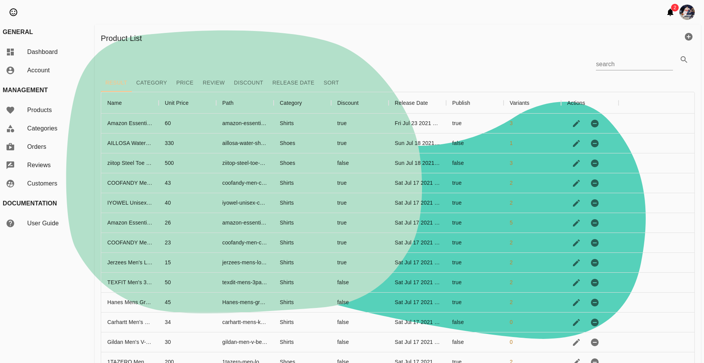
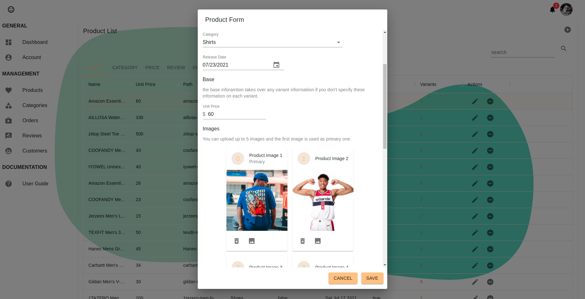
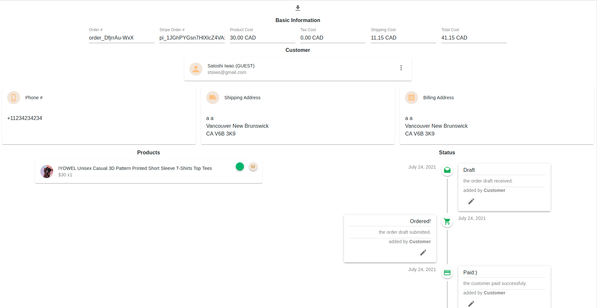
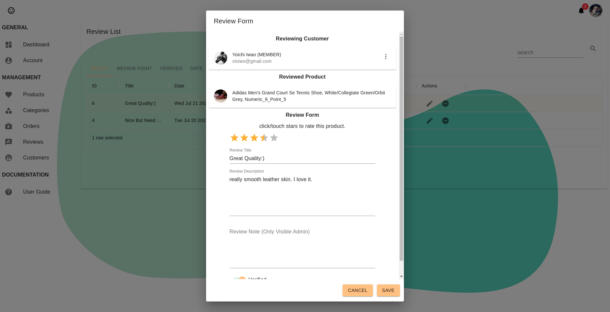

# e-commerce-starter-kits

## Description

An e-commerce web application integrated with [Stripe](https://stripe.com/en-ca) as a payment system and [Canada Post](https://www.canadapost-postescanada.ca/cpc/en/home.page) as a postal service.

## Goal

My goal is to develop a maintainable, testable, and scalable application as much as possible. I focus on OOP and programming architecture to achieve this goal. I explain how I implement it in the following sections.

## Demo

- Guest/Member Page: [https://iwaodev.com/](https://iwaodev.com/)
- Admin Page: [https://iwaodev.com/admin/login](https://iwaodev.com/admin/login)

## End-User Features

  - __Role Management__: guest, member, and admin roles.
  - __Wishlist Management__: members can save products for later.
  - __Cart Management__: guests/members can keep products for their checkout.
  - __Checkout & Online Payment__: guests/members can buy products online.
  
  - __Order History Management__: members can view their orders, and they can update an order event if applicable.
  - __Product Search__: guests/members can search/filter/sort products.
  - __Product Detail__: guests/members can choose a variant (e.g., different color and size) to purchase
  
  - __Account Management__: members/admin can manage their account information (e.g., avatar, basic info, billing/shipping address, phone, and account deletion)
  
  - __Product Management__: the admin can CRUD products. 
  
  
  - __Category Management__: the admin can CRUD categories.
  - __Order Management__: the admin can manage all of the orders by customers.
  
  - __Review Management__: the admin can manage all of the reviews by customers
  
  - __Customer Management__: the admin can CRUD customers.
  - __Login Attempt Limitation__: prevent brute force attack.
  - __Email Verification__: protect email reputation.
  - __Notifications__: members/admin can receive in-app notifications when a crucial event happens  (e.g., a new order was placed, your order was shipped, and so on)
  - __Contact__: guests/members can use the contact form to send inquiries.
  - __Email__: guests/members/admin can receive emails when a crucial event happens (e.g., a new order was placed, your order was shipped, and so on)
  - __Rating__: guests/members can get the estimated shipping cost & delivery date when checkout (integration with Canada Post API).

## Developer Features

  - __Daily Backup__: automate daily backup with [this docker image](https://github.com/databacker/mysql-backup)
  - [Spring Boot Admin](https://github.com/codecentric/spring-boot-admin): admin web interface tool to monitor my back-end API.  

## Tech Stack

### Front End

  - [ReactJS](https://reactjs.org/)
  - [Webpack](https://webpack.js.org/)
  - [Material-UI](https://material-ui.com/)
  - [TypeScript](https://www.typescriptlang.org/)
  - [Redux](https://redux.js.org/)
  - [Redux-Saga](https://redux-saga.js.org/)
  - [Jest](https://jestjs.io/)
  - [React Testing Library](https://testing-library.com/docs/react-testing-library/intro/)
  - [Nginx](https://www.nginx.com/)

### Back End

  - [Open JDK 11](https://openjdk.java.net/projects/jdk/11/)
  - [Spring Boot](https://spring.io/projects/spring-boot)
  - [Hibernate](https://hibernate.org/)
  - [Lombok](https://projectlombok.org/)
  - [MapStruct](https://mapstruct.org/)
  - [AspectJ](https://www.eclipse.org/aspectj/)
  - [Flyway](https://flywaydb.org/)
  - [Spring Security](https://spring.io/projects/spring-security)
  - [Jacoco](https://www.eclemma.org/jacoco/)
  - [JUnit](https://junit.org/junit4/)
	

### Infrastructure

  - [AWS EC2](https://aws.amazon.com/ec2/?ec2-whats-new.sort-by=item.additionalFields.postDateTime&ec2-whats-new.sort-order=desc)
  - [AWS Route53](https://aws.amazon.com/route53/)
  - [AWS SNS](https://aws.amazon.com/sns/?whats-new-cards.sort-by=item.additionalFields.postDateTime&whats-new-cards.sort-order=desc)
  - [AWS SES](https://aws.amazon.com/ses/)
  - [AWS S3](https://aws.amazon.com/s3/)
  - [AWS CloudWatch](https://aws.amazon.com/cloudwatch/)
  - [AWS Lambda](https://aws.amazon.com/lambda/)
  - [Docker](https://www.docker.com/)
  - [Docker-Compose](https://docs.docker.com/compose/)
  - [MySQL](https://www.mysql.com/)

## Architecture

### Front End

I separate each responsibility into different modules:

  - __UI Components__: display UI to users.
  - __Redux-Saga Workers__: handle side effects (e.g., CRUD operation to back-end API).
  - __Redux Store__: keep the state.
  - __Selectors__: filter, sort, or calculate the state as UI components desire. 

### Flow

Here is a typical flow of how each component interacts with the other.

  1. Users trigger an event and run the event handler, or we need initial prep (e.g., useEffect).
  2. Dispatch an action.
  3. If it does not need side effects, move to step 5.
  4. If we need to have side effects (e.g., CRUD operation to back-end API), use watchers and workers in Redux-Saga.
  5. The Redux store receives the updated data and updates the state.
  6. Any UI component, which subscribes to updated data, is updated through its selector where you can filter, sort, or calculate the state if necessary. 

Click [here](https://github.com/stsiwo/e-commerce-starter-kits/blob/main/details.md#reactjs) for more detail.

## Back End

Here are some important details:

  - [Dependency Rule](https://blog.cleancoder.com/uncle-bob/2012/08/13/the-clean-architecture.html): the classes in the higher layer can use or have dependencies of interfaces in the lower layer, not vice versa. For instance, a class in the Infrastructure layer can have dependencies of components in the Application layer, but components in the Domain layer cannot have dependencies of the Application layer. Why? there are some benefits:
    - make your code testable.
    - avoid circular dependencies 
    - easier if the components in the higher layer need to be replaced

  - [Event And Event Handlers](https://www.baeldung.com/spring-events): avoid a thick application service by delegating some tasks to this event and event handlers. this makes it easy to write tests in a decoupled way. For example, if a new order was placed by a customer, the app needs to send a notification and an email to the customer and the admin. If you put that logic in a single application service, it makes me hard to write a test for the service. So, I delegate those tasks to event handlers and publish events.  This allows us to write a test separately and easily.

  - [Optimistic Locking](https://www.baeldung.com/jpa-optimistic-locking): This allows you to handle concurrent updates from multiple users. For example, if two customers try to buy the same product whose stock is only one left, one of the customers ends up buying the product but no stock is available. To handle this we use optimistic locking. If one of the customers bought the product, it automatically throws the exception for the other customer.  

  - [N+1 Problem with Hibernate](https://vladmihalcea.com/n-plus-1-query-problem/): By default, Hibernate does the lazy loading for associations of an entity. This means that when the entity tries to access the association for the first time, it will be loaded from your DB for performance benefit. But, it also brings a performance issue for some cases. For example, when you fetch a collection of an entity (let's say 'Car') whose has one-to-many associations (let's say 'Wheel'), the first fetch loads the collection of the Car entity, and when you try to access the Wheel associations on each Car entity, Hibernate run an additional N queries for it. This is a problem especially when the data is getting large and degrade the performance. To avoid this, you need to use 'fetch join' when you fetch the associations so that it will fetch the associations together. In this case, if you have multiple different associations with your entity, you should separate the query one by one. Otherwise, it will throw a MultipleBagFetchException. ([reference](https://stackoverflow.com/questions/32453989/what-is-the-solution-for-the-n1-issue-in-jpa-and-hibernate))

Click [here](https://github.com/stsiwo/e-commerce-starter-kits/blob/main/details.md#back-end) for more detail.

## Infrastructure

I used Docker Compose to orchestrate the following docker containers:

  - __SPA container (based on an Nginx image)__: this container is responsible for handling incoming requests to my single page application (e.g., domain.com) and the back-end API (e.g., api.domain.com). For the SPA, I put the transpiled source code inside this container. For the back-end API. when receiving a request to the API, I pass the request to the API container.
  - __API container (based on an OpenJDK 11 image)__: this one takes care of any API request and returns the appropriate response. 
  - __DB container (based on MySQL image)__: this container is in charge of any database operation that comes from the backend API. 
  - __DB backup container (based on [databack/mysql-backup](https://hub.docker.com/r/databack/mysql-backup))__: this container regularly makes a backup for the DB container.  

## Security

Click [here](https://github.com/stsiwo/e-commerce-starter-kits/blob/main/details.md#security) for detail.

## Testing

### Back End 

I used Junit, AssertJ, and Spring Testing to do the integration and unit testing.

#### Integration Testing with DB and MockMvc

To test all endpoints from sending a request to persisting the data in DB. 

  - (GET/POST/PUT/PATCH/DELETE) return success status code.
  - (GET/POST/PUT/PATCH/DELETE) return any error status code (e.g., 400 (BAD_REQUEST), 404 (NOT_FOUND), 500 (INTERNAL_SERVER_ERROR)).
  - (GET/POST/PUT/PATCH/DELETE) return 403 status code if a request does not have proper authorization (e.g., access control based on the role).
  - (GET/POST/PUT/PATCH) response DTO contains all of the necessary fields.
  - (GET) sorting/filtering/pagination test with query string parameters.
  - (POST) its association is properly created along with the target resource.
  - (PUT) a target resource is replaced without changing its id.
  - (PATCH) a target resource is partially updated.
  - (DELETE) its association is properly handled (e.g., if the association should be deleted along with the target deletion, make sure it is deleted).

#### Event & Event Handler Testing
  - an event is properly published.
  - an event is properly handled by all subscribed event handlers.
  - an event handler properly handles its use case.
  - any error handling.

#### Domain Unit Testing
  - each domain behavior with its input and output
  - any error handling.

#### Scheduled Task & Domain Service Testing
  - a task/service properly handles its use case.
  - any error handling.

#### Infrastructure Service (Facade) Testing
  - a service properly interacts with an external system.
  - any error handling.

